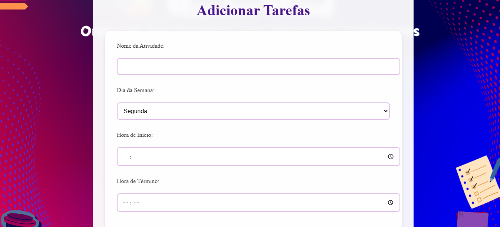

# Greed_Mastermind

# Planejador de Tarefas

**Número da Lista**: 37  
**Conteúdo da Disciplina**: Greed

## Alunos
| Matrícula | Aluno |
| --------- | ----- |
| 221037975 | Natália Rodrigues de Morais |
| 221021975 | Gabriel Santos Monteiro |

##Vídeo
[Link apresentação](https://youtu.be/f3FoBlj6eEg)

## Sobre
O projeto é um **Planejador de Tarefas** que utiliza diferentes algoritmos ambiciosos para organizar e otimizar a execução de atividades. Este aplicativo web permite aos usuários adicionar tarefas e gerar planejamentos eficientes com base em diferentes estratégias.

### Uso de Algoritmos Ambiciosos
O planejador implementa três algoritmos ambiciosos principais:

1. **Planejamento Estratégico (Minimize Lateness)**: Organiza tarefas para minimizar o atraso máximo, considerando dificuldade e prazo.
2. **Planejamento Físico (Interval Partitioning)**: Agrupa tarefas em conjuntos que não se sobrepõem, ideal para organização de espaços.
3. **Planejamento Diário (Interval Scheduling)**: Maximiza o número de tarefas não sobrepostas em um dia.

## Funcionalidades Implementadas

### Interface do Usuário
- Design responsivo com tema visual consistente
- Animações suaves para melhor experiência do usuário
- Modal para visualização detalhada dos planejamentos
- Barra de progresso para acompanhamento de tarefas
- Formulários dinâmicos baseados no tipo de planejamento

### Gerenciamento de Dados
- Armazenamento local persistente
- Visualização organizada por dias da semana
- Cálculo automático de progresso
- Registro de data de criação dos planejamentos

### Planejamentos
- Visualização detalhada de cada planejamento
- Organização por dias da semana
- Cálculo de atrasos para planejamento estratégico
- Agrupamento de tarefas para planejamento físico
- Otimização de horários para planejamento diário

## Screenshots

| Página Inicial                         | Adicionar Tarefas                     |
| -------------------------------------- | ------------------------------------- |
|         |     |

| Resultado do Planejamento              |
| -------------------------------------- |
|    |

## Instalação 
**Linguagem**: JavaScript  
**Framework**: Vanilla JS

### Pré-requisitos
Um navegador web moderno capaz de executar JavaScript ES6+.

### Executando o aplicativo
1. Clone o repositório
2. Navegue até o diretório do projeto
3. Abra o arquivo `index.html` em seu navegador

## Uso
1. Na página inicial, clique em "+ Novo Planejamento"
2. Escolha entre os três tipos de planejamento disponíveis
3. Adicione suas tarefas no formulário específico
4. Use "Adicionar mais tarefa" para incluir tarefas adicionais
5. Clique em "Calcular" para gerar o planejamento
6. Visualize os resultados e detalhes de cada planejamento na tela inicial

## Outros
Este projeto demonstra a aplicação prática de algoritmos ambiciosos em um cenário real de planejamento, oferecendo uma ferramenta intuitiva e eficiente para organização pessoal e profissional.
